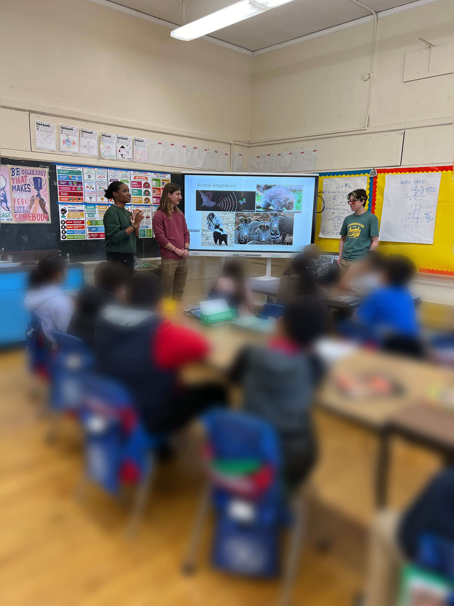

## UConn EEB Educational Outreach
### Partnering with Natchaug Elementary School
- bilingual school in Willimantic, CT
- lots of students from different backgrounds & minority groups
  - helps show them the fun in science
  - gives them a sense of belonging in STEM

[Link to EEB Outreach Website](https://uconneeb.github.io/outreach/elementary-school-outreach.html)

#### Fall 2024
  
  3rd grade classrooms
  - taught about ocean layers and marine life
  - did "ocean in a bottle" craft

  4th grade classrooms
  - had a class discussion about different animal adaptions
  - played a predator-prey tag game to demonstrate advantages of certain adaptations

## YMCA Camp Sloper Outreach