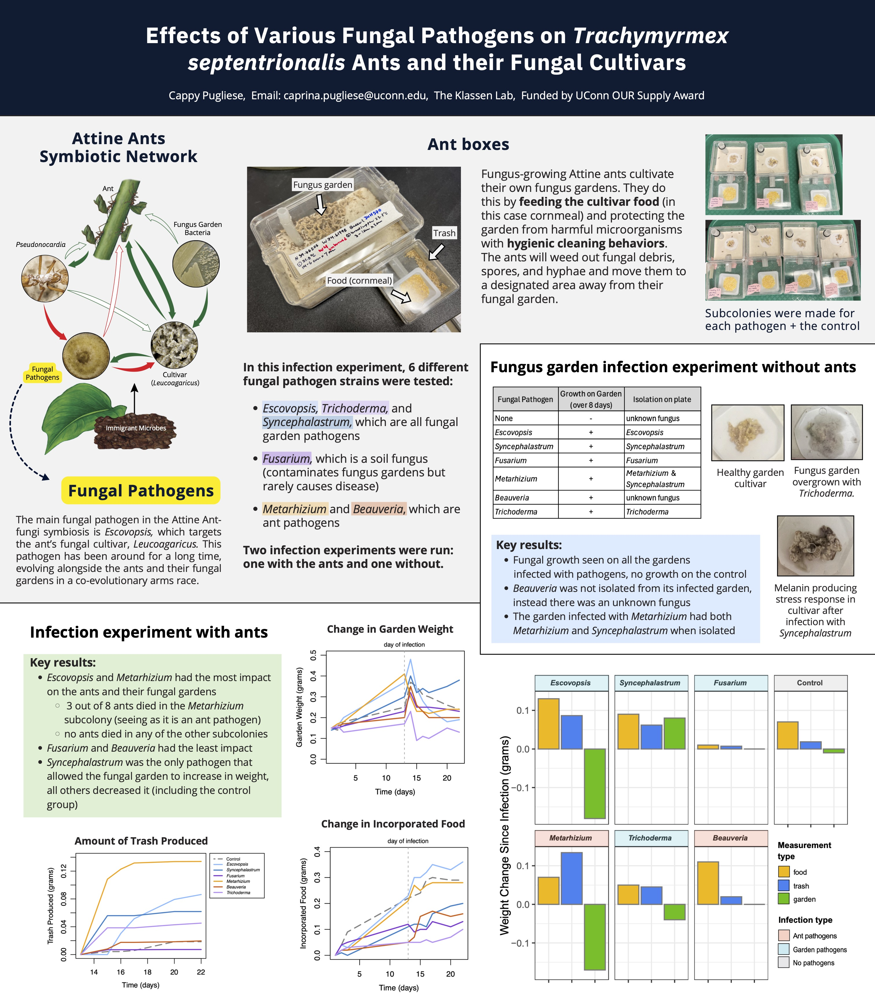

<h2>
Effects of Various Fungal Pathogens on <i>Trachymyrmex septentrionalis</i> Ants and their Fungal Cultivars
</h2>

<h3>
Experiment Overview
</h3>

I tested how a few different species of fungal pathogens affect ants and their fungal gardens. I ran two different infection experiments; one with both the ants and their fungal gardens present and one with only the fungal gardens present. The infection experiment without the ants present was run mainly to make sure that the fungal pathogens were able to properly infect and grow on the ant's fungal gardens. See poster below for more information and visit <a href="https://caprinalpugliese.wixsite.com/leafcutter-ants" target="_blank">my leafcutter ant behavior website</a> to learn more about the ant and fungal symbiosis!

<button onclick="window.open('/assets/pdfs/poster-presentation.pdf', '_blank')" type="button">
        View Presentation Poster</button>
        
